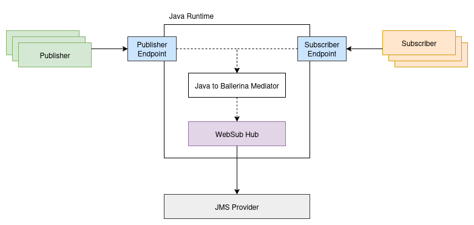
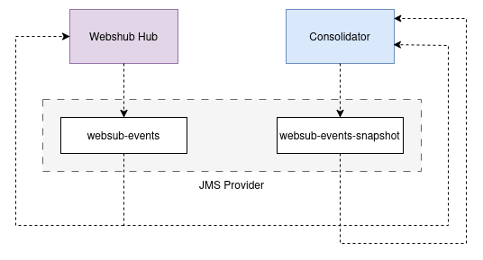

# JMS WebSubHub

## Contents

1. [Overview](#1-overview)
2. [Goals and technical requirements](#2-goals-and-technical-requirements)
3. [Implementation](#3-implementation)
   * 3.1. [State management](#31-state-management)
   * 3.2. [Other quality of services](#32-other-quality-of-services)
4. [Invoking the APIs from Java environment](#4-invoking-the-apis-from-java-environment)
   * 4.1. [Invoking the `consolidator` API](#41-invoking-the-consolidator-api)
   * 4.2. [Invoking the `hub` API](#42-invoking-the-hub-api)
5. [Deploying the system locally](#5-deploying-the-system-locally)
   * 5.1. [Prerequisites](#51-prerequisites)
   * 5.2. [Setting up IBM MQ](#52-setting-up-ibm-mq)
   * 5.3. [Deploying the `consolidator`](#53-deploying-the-consolidator)
   * 5.4. [Deploying the `hub`](#54-deploying-the-hub)
6. [References](#6-references)

## 1. Overview

This WebSub `Hub` implementation introduces a functional API-driven approach that enables triggering the WebSub flow directly from within a Java environment. WebSub `Hub` implementations can be written using multiple approaches including in-memory, database-based, message-broker based etc. 

Given their shared purpose, message brokers are inherently well-suited for implementing WebSub `hubs`. This implementation leverages the [JMS API](https://www.oracle.com/java/technologies/java-message-service.html), with [IBM MQ](https://www.ibm.com/products/mq) selected as the underlying JMS provider.

## 2. Goals and technical requirements

When developing the `hub` implementation, we prioritized several goals and technical requirements, in addition to 
ensuring compliance with the WebSub specifications, which is guaranteed by the provided APIs. 
These considerations included:

1. State persistence: 
   <br/>The ability to persist the hub's state allows for seamless recovery even after a restart or unexpected interruption.

2. Resume message delivery: 
   <br/>In cases where subscribers become unavailable temporarily and then become available again, the implementation ensures 
   that message delivery resumes smoothly, preventing any loss of notifications.

3. Handling transient delivery failures: 
   <br/>The implementation gracefully handles transient failures that may occur during message delivery between the hub 
   and the subscribers, ensuring that messages are eventually delivered without disruption.

4. Ability to invoke within a Java environment:
   <br/>The hub should be easily invocable from Java applications through a functional API-based approach.

5. Scalability: 
   <br/>The implementation is designed to seamlessly scale based on the number of subscribers, allowing for efficient 
   handling of a growing subscriber base without sacrificing performance or reliability.

By addressing these goals and technical requirements, the `hub` implementation provides a robust and feature-rich 
solution for distributed publisher-subscriber system.

## 3. Implementation

As previously mentioned, this implementation relies on a JMS provider (IBM MQ), which handles the majority of the workload. 

At a high level, the following key components are associated with this implementation.
                    
|  |
|:----------------------------------------------------------------------------:|
| *Image 1: Current system architecture*                                       |


Within the current system architecture, there are two primary components: the `hub` and the `consolidator`. The `hub` functions as a Websub `hub`, while the `consolidator` is responsible for overseeing the system's overall state by merging state-update events into a single consolidated state.

### 3.1. State management

To manage the system's state, both the `hub` and the `consolidator` make use of two JMS topics. The `websub-events` topic is utilized for broadcasting system state update events to all relevant parties, while the `websub-events-snapshot` topic serves as a storage location for the current snapshot of the system's overall state.

|  |
|:-----------------------------------------------------------------:|
| *Image 2: System topic usage*                                     |


While both the `hub` and the `consolidator` listen to `websub-events` topic, `websub-events-snapshot` topic is only used by the `consolidator`. Whenever the `consolidator` re-starts, it will read the latest snapshot state from `websub-events-snapshot` topic and re-initialize the state. But, whenever the `hub` restarts it shoult retrieve the latest state snapshot from the `consolidator`.

Following JSON structure is used to store the state-snapshot in the `websub-events-snapshot` topic.
```json
{
   "topics":[
      {
         "topic":"orgA-test",
         "hubMode":"register"
      },
      ...
   ],
   "subscriptions":[
      {
         "verificationSuccess":true,
         "hub":"<hub-URL>",
         "hubMode":"subscribe",
         "hubCallback":"https://sample.subscriber.com",
         "hubTopic":"orgA-test",
         "hubLeaseSeconds":"864000",
         "hubSecret": "secret-1234",
         "SERVER_ID":"server-1",
         "subscriptionName":"orgA-test-30055"
      },
      ...
   ]
}
```

Each WebSub `topic` directly maps to a JMS `topic`, and each WebSub `subscriber` is represented by a durable JMS `subscription` associated with that topic.

### 3.2. Other quality of services

For message persistence and subscription management, the implementation utilizes the JMS provider (in this case IBM MQ).

## 4. Invoking the APIs from Java environment

### 4.1. Invoking the `consolidator` API

The `consolidator` offers an API to retrieve the latest state snapshot for the system. 

| Function Name    | Description                                           | Argument Type  | Argument Structure | Return Type | Return Type Structure                                                                      |
|------------------|-------------------------------------------------------|----------------|--------------------|-------------|--------------------------------------------------------------------------------------------|
| getStateSnapshot | Retrieves the latest state snapshot for the system.   | N/A            | N/A                | json        | { topics: websubhub:TopicRegistration[], subscriptions: websubhub:VerifiedSubscription[] } |

### 4.2. Invoking the `hub` API

The `hub` offers APIs to initiate the WebSub flows.

| Function Name     | Description                                                  | Argument Type | Argument Structure                                                                                                    | Return Type | Return Type Structure                                |
|-------------------|--------------------------------------------------------------|---------------|-----------------------------------------------------------------------------------------------------------------------|-------------|------------------------------------------------------|
| initHubState      | Initialize the `hub` state and start the state-sync process. | json          | { topics: websubhub:TopicRegistration[], subscriptions: websubhub:VerifiedSubscription[] }                            | N/A         | N/A                                                  |
| isTopicExist   | Checks whether a particular WebSub `topic` exists in the `hub`.                  | string          | "topic-a"                                                                                    | boolean        | `true` or `false` |
| onRegisterTopic   | Handles registration of a new WebSub topic.                  | json          | { topic: string, hubMode: string }                                                                                    | json        | { statusCode: int, mediaType: string, body: string } |
| onDeregisterTopic | Handles deregistration of an existing WebSub topic.          | json          | { topic: string, hubMode: string }                                                                                    | json        | { statusCode: int, mediaType: string, body: string } |
| onUpdateMessage   | Processes an new content updates for a given topic.          | json          | { msgType: string, hubTopic: string, contentType: string, content: json }                                             | json        | { statusCode: int, mediaType: string, body: string } |
| onSubscription    | Manages new subscription requests to a topic.                | json          | { hub: string, hubMode: string, hubCallback: string, hubTopic: string, hubLeaseSeconds: string?, hubSecret: string? } | json        | { statusCode: int, mediaType: string, body: string } |
| onUnsubscription  | Handles unsubscription requests from a topic.                | json          | { hub: string, hubMode: string, hubCallback: string, hubTopic: string, hubLeaseSeconds: string?, hubSecret: string? } | json        | { statusCode: int, mediaType: string, body: string } |

## 5. Deploying the system locally

### 5.1. Prerequisites

1. Ballerina SL 2201.10.5 or higher
2. IBM MQ v9.4.0.10
3. IBM MQ dependencies for `fscontext.jar` and `providerutil.jar` files are required for this implementation. These JAR files come with the IBM MQ installation. Refer to [this article](https://www.ibm.com/docs/en/ibm-mq/9.4.x?topic=messaging-what-is-installed-mq-classes-jms) to locate them on your local setup. In a Docker-based setup, you can find the JAR files in the `/opt/mqm/java/lib` directory. Use the following commands to copy the files from the docker container.

    ```sh
    # copy `fscontext.jar`
    docker cp ibmmq-server:/opt/mqm/java/lib/fscontext.jar <destination-path>

    # copy `providerUtil.jar`
    docker cp ibmmq-server:/opt/mqm/java/lib/providerutil.jar <destination-path>
    ```

4. JNDI bindings for IBM MQ JMS API are required. To create the JNDI bindings use [IBM MQ Explorer](https://www.ibm.com/docs/en/ibm-mq/9.4.x?topic=mq-explorer). Refer to [this article](https://ayesh9303.medium.com/jms-with-ballerina-lang-part-6-35ac842014a9) to understand how to create JNDI bindings for IBM MQ JMS API.

    > **Note :** In this setup, two connection factories—`BallerinaHubConnectionFactory` and `BallerinaConsolidatorConnectionFactory`—must be created, each with a unique client identifier for the **hub** and **consolidator**, respectively.

### 5.2. Setting up IBM MQ

To set up IBM MQ locally, please refer to [this guide](https://www.ibm.com/docs/en/ibm-mq/9.4.x?topic=migrating-installing-uninstalling).

To set up IBM MQ using a Docker container, navigate to the `module-ballerina-websubhub/examples/jms-websubhub` directory and use the provided `docker-compose.yaml` file. Then, run the following command:


    ```sh
    docker compose up
    ```

### 5.3. Deploying the `consolidator`

1. Update the native dependency path for following dependencies in the `consolidator/Ballerina.toml`

    ```toml
    [[platform.java17.dependency]]
    path="/<path-to-downloaded-location>/fscontext.jar"

    [[platform.java17.dependency]]
    path="/<path-to-downloaded-location>/providerutil.jar"
    ```

2. Update the `providerUrl` field under `consolidatorsvc.config.brokerConfig` in the `consolidator/Config.toml` file to point to the file system location of the JNDI bindings.
3. Build the `consolidator` project using the following command.
    
    ```sh
      bal build consolidator
    ```

4. Copy the `consolidator/target/bin/consolidatorsvc.jar` file to the Java-based environment where the setup will be embedded, and ensure it is included in the runtime classpath. Additionally, set the path to `consolidator/Config.toml` in the `BAL_CONFIG_FILES` environment variable.
5. Invoke Ballerina runtime `init` from the Java environment to start the consolidator service.
6. When the `consolidator` starts successfully, the following log message will be printed.

    ```sh
    Event consolidator service started successfully
    ```

### 5.4. Deploying the `hub`

1. Update the native dependency path for following dependencies in the `hub/Ballerina.toml`

    ```toml
    [[platform.java17.dependency]]
    path="/<path-to-downloaded-location>/fscontext.jar"

    [[platform.java17.dependency]]
    path="/<path-to-downloaded-location>/providerutil.jar"
    ```

2. Update the `providerUrl` field under `jmshub.config.brokerConfig` in the `hub/Config.toml` file to point to the file system location of the JNDI bindings.
3. Build the `hub` project using the following command.
    
    ```sh
      bal build hub
    ```

4. Copy the `hub/target/bin/jmshub.jar` file to the Java-based environment where the setup will be embedded, and ensure it is included in the runtime classpath. Additionally, set the path to `hub/Config.toml` in the `BAL_CONFIG_FILES` environment variable.
5. Invoke Ballerina runtime `init` from the Java environment to start the consolidator service.
6. Retrieve the latest system state by calling the `getStateSnapshot` API of the `consolidator`, and then use the returned data to invoke the `initHubState` function on the `hub`.
7. When the `hub` starts successfully, the following log message will be printed.

    ```sh
    Websubhub service started successfully
    ```

## 6. References
- [IBM MQ](https://www.ibm.com/docs/en/ibm-mq/9.4.x?topic=mq)
- [IBM MQ Explorer](https://www.ibm.com/docs/en/ibm-mq/9.4.x?topic=mq-explorer)
- [Setting up Ballerina JMS connectivity with IBM MQ](https://ayesh9303.medium.com/jms-with-ballerina-lang-part-6-35ac842014a9)
