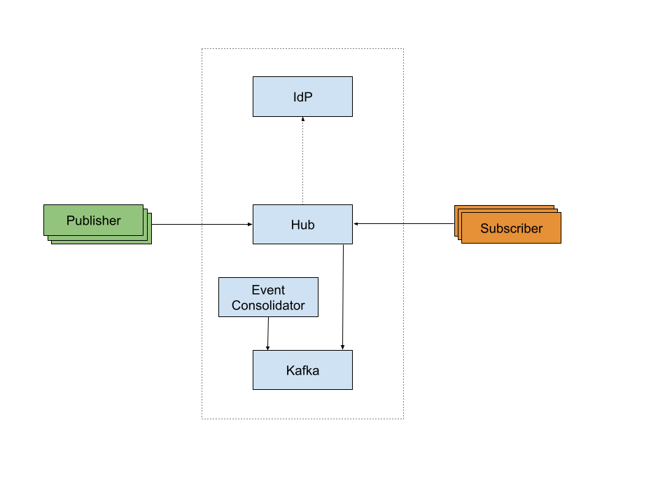

# A Websub Hub Based on Kafka 

# Overview 
The purpose of this example is to demonstrate how to write a production ready hub with minimum code. This example should be a good starting point to get started with your hub implementations.

This is a websub hub implementation done using the APIs provided by the websubhub package. These APIs can be used to implement a vast array of different websub hubs such as in-memory, file based, database based, message broker based, etc. 

This particular implementation is based on message brokers. In this case we have used Kafka message broker to implement the websubhub APIs. Message brokers are a natural fit for the implementation of websub hubs as they serve a similar purpose. 

In addition to the hub implementation, this example also demonstrates the publisher APIs that are available in websubhub. These APIs can be used to publish messages, register/deregister topics. Please note that publishing messages to the hub is not part of the websub specification. Therefore, these APIs could be different when it comes to other hub implementations. 

However, regardless of the APIs used to publish messages to the hub, websubhub APIs can be used to implement websub hubs which are fully compliant with the websub specification.

This implementation is also validated against the [websub.rocks](https://websub.rocks/) test suite. 

# Goals and Technical Requirements
Following are some of the goals and technical requirements which we considered when writing the example hub, in addition to being websub spec compliant which is guaranteed by the APIs.

- Ability to persist the state so that hub can be recovered even after a restart 
- Resume message delivery in case subscribers become unavailable and available again after some period of time
- Gracefully handle transient message delivery failures between the the hub and the subscriber 
- Ability to authenticate and authorize hub operations such as publishing to hub, subscribing, unsubscribing, etc
- Ability to scale seamlessly based on number of the subscribers

# Implementation 
As mentioned above implementation is based on Kafka message broker. Therefore, the Kafka message broker will be doing most of the heavy lifting. At a high level following are the key components associated with this implementation.



As you can see the current implementation is relying on two different technologies. An IdP is used to handle any authentication and authorization request. This would be the normal case in any production environment. For the other quality of services such as message persistence, subscription management, etc the implementation depends on Kafka message broker. 

## Security
As mentioned above apart from standard SSL/TLS, for authentication and authorization the hub depends on an external IdP. In this case we have used a docker image of WSO2 identity server. OAuth2 is used as the authorization protocol along with JWT tokens.

This hub is only concerned about the communication between publishers and the hub as well as subscribers and the hub. The communication between the hub and the Kafka broker is not considered in this implementation to keep it simple even though it is a trivial task.

Anyway, for this purpose any other production ready IdP can be used as OAuth2 and JWT are industry standards. 

## Other Quality of Services 
The rest of the features such as message persistence and subscription management are handled using Kafka message broker. You can use any other message broker for this purpose. But we thought of going with Kafka as it is quite well-known in the industry. 

This example uses a single node Kafka cluster. But in reality it can span across many nodes.

# Usage 
This section discusses starting the hub, subscribing to the hub and message publishing to the hub.
Starting the Hub
Before starting the hub, both the WSO2 Identity Server and the Kafka message broker should be up and running.

## Starting Apache Kafka

* Download **Apache Kafka** from [here](https://kafka.apache.org/downloads).
* Extract the `zip` file and go into `kafka_2.13-2.7.X` directory.

* Run the following commands to start the `kafka broker`.
```
./bin/zookeeper-server-start.sh config/zookeeper.properties
```

```
./bin/kafka-server-start.sh config/server.properties
```

* For more information on **Apache Kafka** go through [following guides](https://kafka.apache.org/quickstart).

## Starting the WSO2 Identity Server (IS)
We have already published pre-configured WSO2 IS to the docker hub. Therefore to start the IdP use the below command.

```
docker container run -d --name wso2-is-instance -p 9443:9443 ayeshalmeida/wso2-is:5.11.0.update
```

If you are interested in what we have configured in WSO2 IS, check the Appendix section. Please note that we haven’t made an effort to bind scopes to user claims as our goal is only to mimic the interaction between the hub and the IdP.

## Starting the Hub
Once those servers are up and running the hub can be started using the following commands. First the project needs to be built using the below command.
```
bal build 
```

Then to run the project execute the below command.

```
bal run target/bin/kafka_hub_service.jar
```

### Starting Multiple Hub Instances

* Copy the `kafka_hub_service.jar` to another location.

* Copy the `Config.toml` which you could find in the project root directory.

* Change the `SERVER_ID` and `HUB_PORT`.

* Go into that location and run the following command.
```
bal run kafka_hub_service.jar
```

## Registering Topics
After all prerequisites are finished the first interaction to the hub could be made by registering a topic. We have included a sample to understand the usage of `websubhub:PublisherClient` in the `examples` directory inside the project. Execute the following command to build the `topic_registration_client.bal`.

```
bal build topic_registration_client.bal
```

Then execute the below command to run the program.

```
bal run topic_registration_client.jar
```

## Subscribing to the Hub
Now we have registered a `topic` in the hub. Next we could subscribe to the previously registered `topic` using `websub:SubscriberService`. Build `subscriber_service.bal` inside `examples` directory inside the project using the following command.

```
bal build subscriber_service.bal
```

Then execute the below command to run the program.

```
bal run subscriber_service.jar
```

## Publishing to the Hub
Content publishing could be considered as the final stage of interaction between a publisher, hub and subscriber. `websubhub:PublisherClient` has support to publish content to the hub. Find the `content_publish_client.bal` located in `examples` directory and execute the following command to build the program.

```
bal build content_publish_client.bal
```

Then execute the below command to run the program.

```
bal run content_publish_client.jar
```

# Scaling the Hub
The scaling of the hub can be done vertically or horizontally. As the hub itself does not maintain any state, those can be scaled up and down as needed. The entire cluster of hubs can be considered as one unit as in you can publish to a particular hub and consume the update message from another hub.

This is possible because all the state is maintained using Kafka. Kafka itself can be horizontally scaled seamlessly which is one of the key advantages of using Kafka.

However, for subscriptions and unsubscriptions it is required to use sticky load balancing. Sticky load balancing could be done using something unique to the subscribers such as unique path segment, token, etc. A design choice made to make the internal network less chatty and optimize hub resource usage. 

Lastly, IdP (in this case WSO2 Identity Server) can be scaled based on load as well. But compared to the hub and the Kafka broker, the IdP gets a very low number of requests. Therefore may not need to be scaled as much as the other two.

# Further Considerations
As mentioned above this example is kept simple intentionally by dropping out certain aspects such as configurability, security between the hub and the Kafka broker, Observability, etc. You can easily incorporate these into the hub implementation. For instance, you can publish data to the ELK to generate different kinds of reports. The Ballerina Kafka client supports observability out of the box, so enabling observability could give you real time insight into the running cluster. But those deserve examples on their own. We hope to discuss those things in future articles.

# Appendix 
## Configuring WSO2 Identity Server (IS)

Following steps describes how to configure the WSO2 Identity Server to provide JWT based authentication.

- Login to Identity Server. (URL: https://localhost:9443/carbon / Username: admin / Password: admin)
- In the left pane select Service Providers -> Add.
Provide a unique name for `Service Provider Name` and click Register.
- Go into Inbound Authentication Configuration -> OAuth/OpenID Connect Configuration and select Configure.
- Select OAuth Version to 2.0.
- Select Client Credential as Allowed Grant Types.
- Select Enable Audience Restriction and add `ballerina` as an audience.
Select JWT as the Token Issuer and click Add.
Copy OAuth Client Key and OAuth Client Secret which is used in configuring WebSub Publisher and Subscriber.
